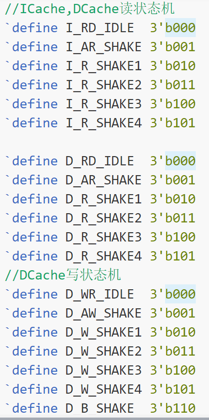

## AXI代码说明

### 1、文件分布
```
    - AXI_Interface.v : 该文件是AXI控制模块,实现AXI接口和远端axi_ram交互;和Cache与Uncache交互;
    - AXICache_defines.vh : 和AXI与Cache的相关定义都写在该头文件中
```

### 2、阅读方法
```
    由于对《CPU设计实战》上的不少接口做了修改，所以阅读代码时可能觉得有些地方比较奇怪。
    这里，我对个人认为需要注意的地方，都在注释中使用了"Attention"这个英文单词。打开vscode,只要查询该单词,就可以找到全部的注意点。
    然后,注释中还使用了"TODO"这个单词，表明某些地方本人认为没哟完成，需要完善。
```

### 3、文件架构
```
    这里主要说AXI_Interface.v文件。
    目前只是涉及了ICache和DCache的处理，还没加入Uncache。
    文件总体可以分为四块:最开始是信号定义部分,然后是信号赋值部分,然后是状态机控制部分（目前有三组,之后加上Uncache之后应该会有五组），最后是
axi_crossbar仲裁部分(调用IP核)
```

### 4、命名规则
```
在AXICache_defines.vh中，有状态机各个状态的命名，参考下图。这些状态的转移规则可以在study_record/AXI.drawio中找到。
```


```
然后在AXI_Interface.v中:
- 1、对于AXI接口，如果是由ICache生成，则前缀为inst;如果是由DCache生成，则前缀为data;如果是
- 2、对于和Cache的交互信号，如果是和ICache交互，则前缀为icache;如果是和DCache交互，则前缀为dcache;
```

