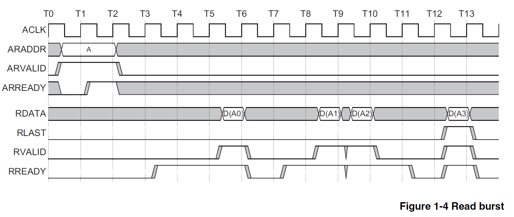
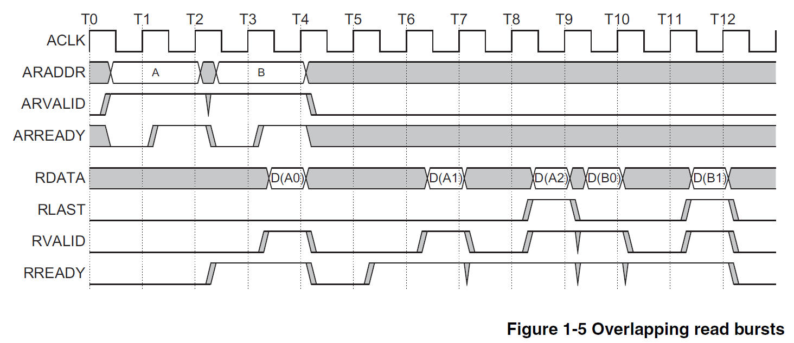
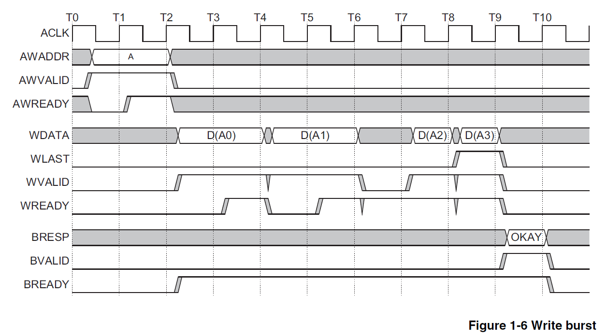
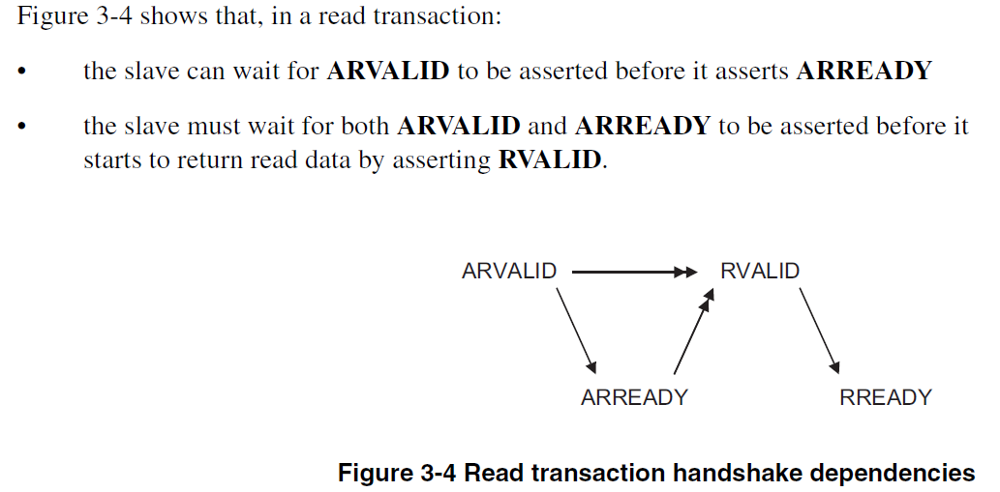
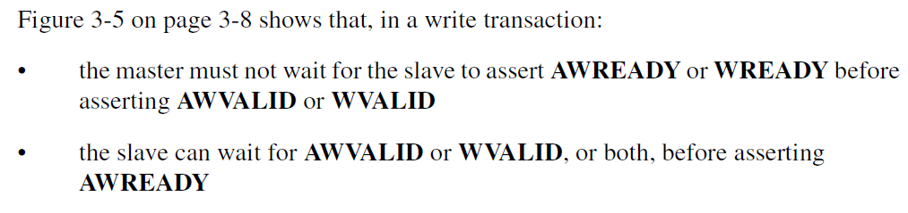
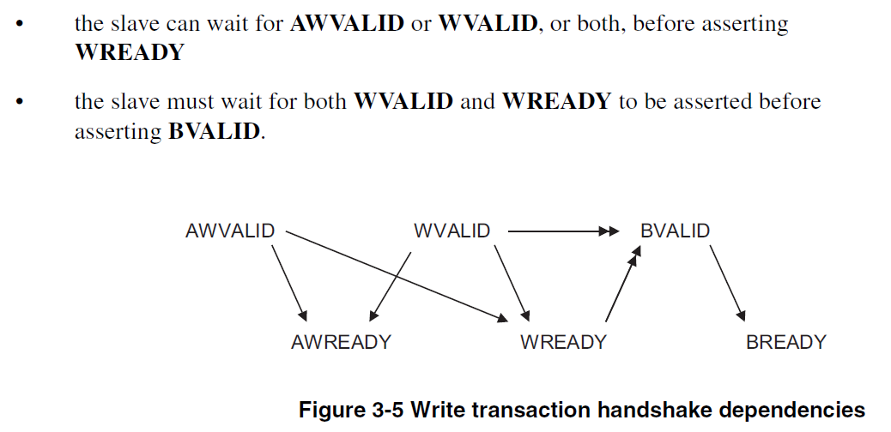

## 2022.4.3 AXI基本概念

```
参考资料:AMBAaxi官方文档,《CPU设计实战》第八章
```

### 1.burst传输模式

#### 1.1 为什么设计该模式

```
    首先说明，burst传输模式是针对Cache设计的。Uncache是用不到burst传输模式的。
    Cache可能会一次性从RAM读取/向RAM写很多连续的数据(比如说,128位)。然而总线的宽度只有32位。这个时候，如果我们还是每个字都发一个请求,
进行一次握手,就需要4次。而且握手不可能瞬间完成，所以很浪费时间。
    burst模式则是指明了读数/写数的初始地址addr，然后指明要处理几个字的数。这样只要发一次请求，进行一次握手就完事了。当然前提是，这几个字都
挨在一起。
```

#### 1.2 读写示例
```
    信号的定义参考《CPU设计实战》196-197。
    对于AXI读,总共有两组通道:读请求通道(ar开头)和读相应通道(r开头)。CPU作为master端,AXI作为slave端。
    对于AXI写，总共有三组通道:写请求通道(aw开头),写数据通道(w开头),写响应通道(b开头)。至于为什么写多了一个通道，参考《CPU设计实战》201。
简单说，就是写后读的冒险问题。写响应通道通知CPU数据是否都写进去，防止还没写完就发出读请求。
    尤其关注CPU端的信号发射情况。
    《CPU设计实战》200页建议awvalid和wvalid同时置为有效，虽然写请求和写数据没有依赖。
    《CPU设计实战》201页指出一定要考虑后发出的请求先返回的状况。不过我看学长的代码，似乎是通过控制ID值一样，保证先发出的请求先返回。
```




#### 1.3 burst相关参数
```
    burst length:指明一次burst传输多少次数据
    burst size:指明burst中每次传输传递多少个字节
```

### 2.信号依赖处理
```
    下面第一张:分析读事务依赖状况;第二张和第三张分析写事务的依赖状况。
```



