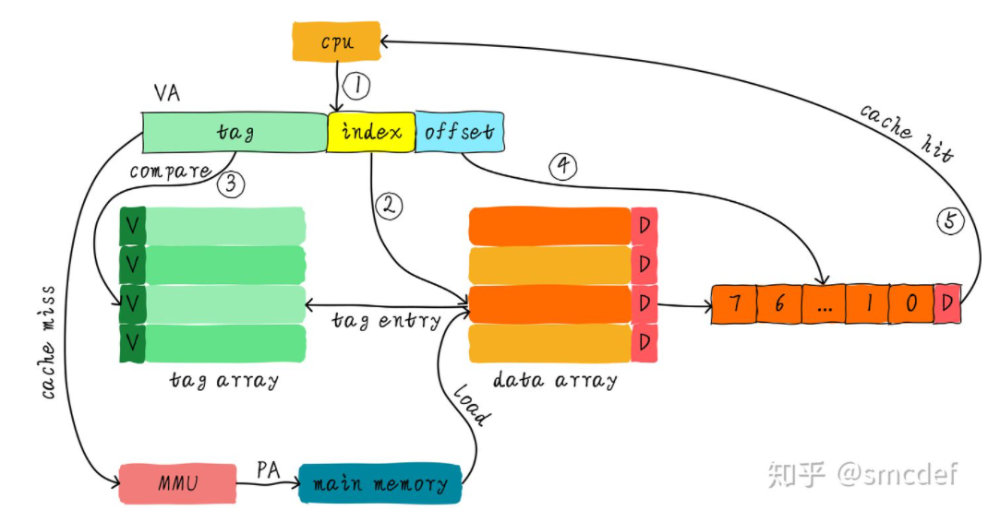
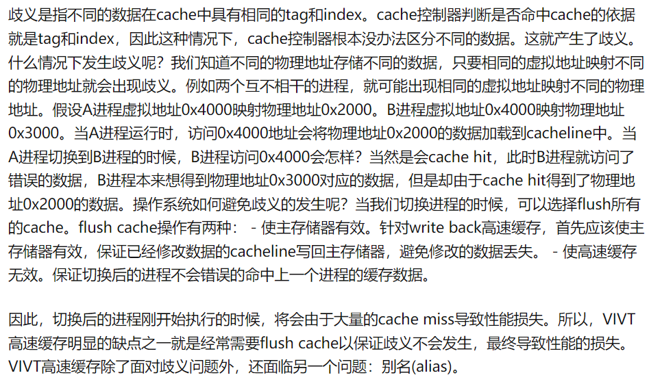
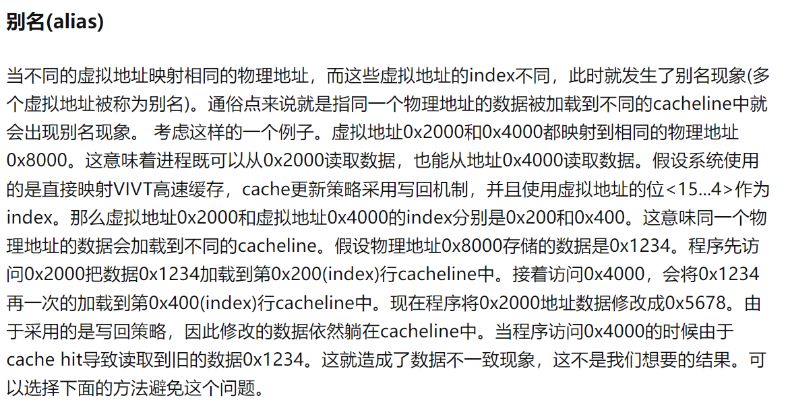
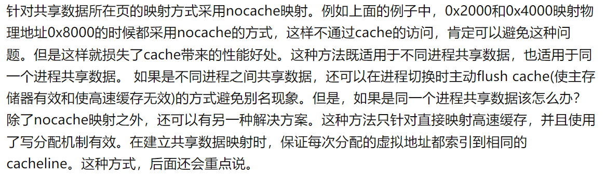
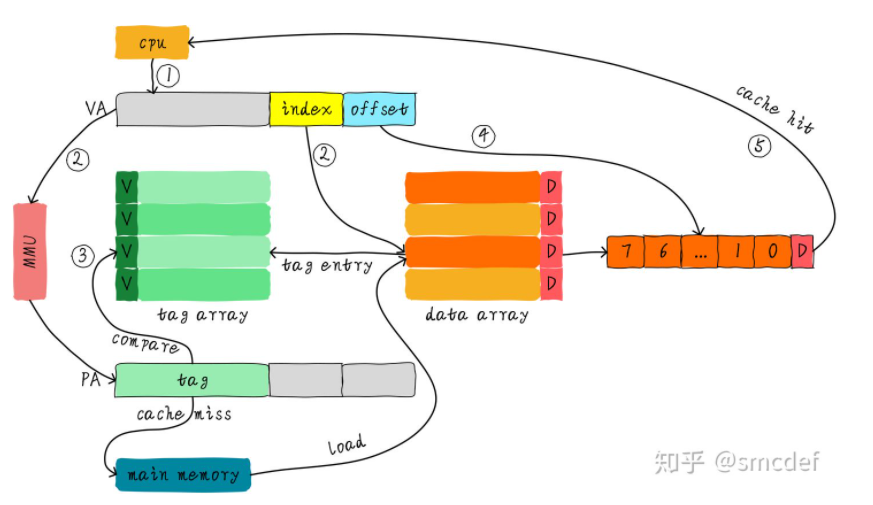
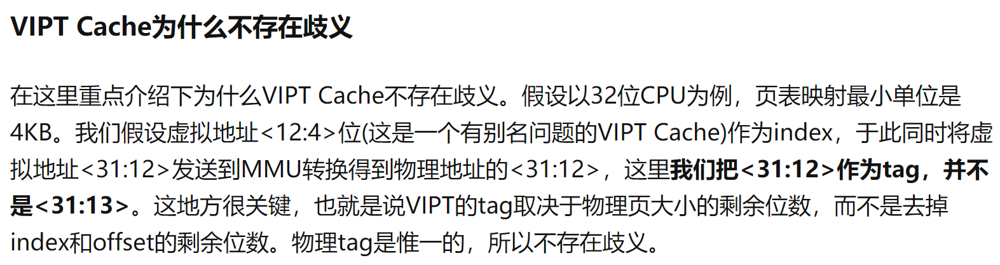
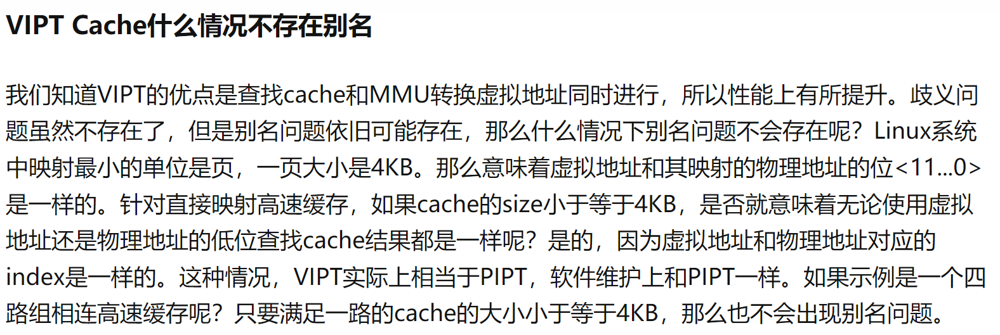

## 2022.4.4 Cache组织方式

```
参考资料:
    https://zhuanlan.zhihu.com/p/107096130
```

### 1.讨论的核心问题
```
    cache控制器根据地址查找判断是否命中，这里的地址究竟是虚拟地址(virtual address，VA)还是物理地址(physical address，PA)？
    我们应该清楚CPU发出对某个地址的数据访问，这个地址其实是虚拟地址，虚拟地址经过MMU转换成物理地址，最终从这个物理地址读取数据。
    因此cache的硬件设计既可以采用虚拟地址也可以采用物理地址甚至是取两者地址部分组合作为查找cache的依据。
```

### 2.三种组织方式:VIVT,PIPT,VIPT
- 其中 VIPT是《CPU设计实战》推荐采用的方式
#### 2.1 虚拟高速缓存(VIVT) -- 基本概念
```
    VIVT指地址的index域和tag域都用虚地址。这种方式比较自然，基本上除了cache miss的时候需要把虚地址转实地址，来访问memory之外，就没什么事情了。
一直用虚地址肯定比较方便。当然不用想，越简单bug越多。
```

#### 2.2 虚拟高速缓存(VIVT) -- 歧义(ambiguity)与别名(alias)
```
    主要设计操作系统方面的问题。这地方知乎的文章讲的非常好，我还是复制粘贴了。
    如果要总结的话:歧义就是相同的虚地址却对应不同的实地址;别名就是相同的实地址却对应不同的虚地址。
    解决歧义问题导致操作系统不断进行flush cache操作降低性能;解决别名问题需要绕过cache访问导致降低性能。
```




#### 2.3 物理高速缓存(PIPT)
```
    PIPT指地址的index域和tag域都用实地址。这就是考虑了上面VIVT遇到的问题，干脆直接全用MMU将虚地址转换为实地址，一劳永逸。当然效率肯定不会太高。
```

#### 2.4 物理标记的虚拟高速缓存(VIPT) -- 基本概念
```
    VIPT指的是地址的index域用虚地址，tag域用实地址。
    tag的虚实地址转换（MMU）和index,offset在Cache块中的定位同时进行，这样可以提高效率。
```


#### 2.5 物理标记的虚拟高速缓存(VIPT) -- 歧义(ambiguity)与别名(alias)
```
    首先，由于VIPT以物理地址部分位作为tag，所以并不存在歧义问题（即一个虚地址对多个实地址）。具体见下面第一张图。一定注意tag部分和addr中的tag域不同。
    但是index部分还是虚地址，可能存在别名问题。
    什么时候不存在别名问题呢？可以看下面第二张图片。可以得知，对于linux系统来说，只要保证cache size每一路大小小于等于4KB,就不会有别名。
    《CPU设计实战》一书推荐实现Cache的容量都是8KB，都为两路组相连，这就很好的解决了别名的问题了。
```



