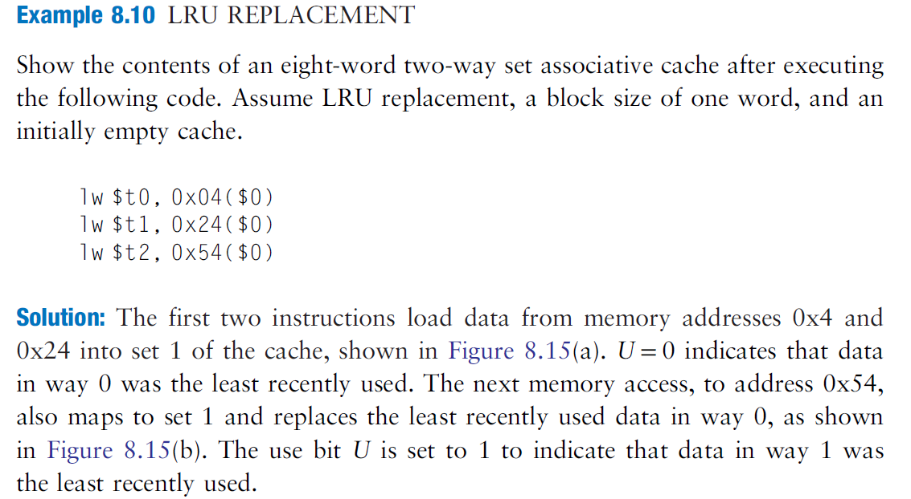
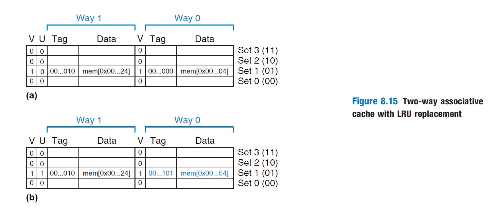

## 2022.4.4 伪LRU算法

```
参考资料:
    Digital Design and Computer Architecture, Second Edition by David M. Harris, Sarah L. Harris 8.3
```

### 基本概念和一些粗浅的理解
```
    个人理解:LRU即为least recently used。对于组相连架构的Cache,在需要替换cache line的时候,我们会优先挑
最久没有使用的那一块给替换掉。（因为刚刚替换掉的很有可能很快要用）
    那如果相连度比较高(比如四路组相连),肯定是比较麻烦的，要上counter了，不好。
    好在我们是一个二路组相连的Cache。那么，可以按照下图所述去操作。（U=0,对应way0是least recently used）
    伪LRU算法其实是对LRU算法的简化。不过这可能对于四路组相连以上的有用。感觉对于二路组相连是个伪命题，先不考虑。
```


