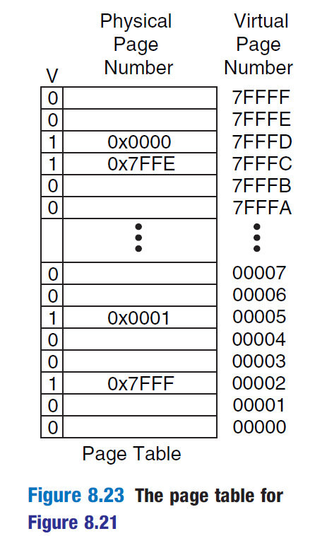

## csy观Virtual Memory和TLB
```
    参考资料:《Digital Design and Computer Architecture, Second Edition by David M. Harris, Sarah L. Harris (z-lib.org)》
```

### Virtual Memory（虚拟存储器）

#### 1.基本概念
```
    大家都知道，硬盘的容量是最大的，但是访问特别慢。主存比硬盘要小很多，但是访问快。（这里的主存可以理解为physical memory）
    Virtual Memory的作用就是:营造一个假象,让我们以为主存有硬盘那么大，而且对于绝大多数访问，访问速度都有访问主存那么快。个别访问可能就会引发
缺页故障(Page fault)，那就很慢了，不过是小概率事件。从这个角度上来说，Physical Memory其实就相当于Virtual Memory的Cache。所以建议先把Cache
概念搞清楚再看这一块，会明朗很多。
    至于虚实地址转换，这就是页表和TLB干的事情。
```

#### 2.Virtual Memory和Cache术语的对应关系
```
    下面有一张对照表，可以参考。接下来就分析这些术语的含义。
```

```
    接下来就分析这些术语的含义。
    Page(页):就是一段连续的数据,相当于Cache中的块。不管是在Virtual Memory还是Physical Memory中，都被划分为若干个“页”，且页大小相同。
    Page size(页的大小):一页我们定义为4KB。
    Page offset和Virtual page number:这个对应于下图图片1中的Page Offset和VPN。如果了解Cache的话，其实分别对应于Cache中的offset和tag。不过,
Cache中不是还有一个Index域吗？这是因为，Virtual Memory的任一页可以映射到Physical Memory的任一页。在Cache中，就对应一个全相连映射。全相连
映射中，Index恒为1，所以这里直接就把Virtual Address和Physical Address分成两段了,而没有分三段。（可以参考图片2中的映射关系）
```
图片1：


图片2：


### Page Table(页表)和TLB(快表)
#### 1.页表基本概念
```
    页表是管理虚实地址转换的，就放在Physical Memory中。页表中会存储两样信息：物理页号，以及valid bit。valid bit=0,表明我们需要的那一页在
硬盘上;valid bit=1，就我们需要的那一页在Physical Memory中。可以参考下图。在下图中，物理页号是15位的，我们到时候应该是17位。
    有了页表之后，我们想要获得真实的物理地址就要分两步走:首先，利用虚地址的虚页号，去查页表;然后从页表中查出物理页号，再拼上page offset，得到
物理地址，用其访问数据。页表很大（这个应该能看出来吧），访问速度肯定比较慢，这就是为什么之后要引入TLB。
    缺页故障，就是访问页表时，发现valid bit=0。这就比较糟糕了，表明我们需要的那一页在硬盘上，需要上百万个时钟周期，把页调到Physical Memory中。
    和TLB不同，页表记录的虚实地址转换信息是完备的。
```


#### 2.虚实地址映射过程
    直接上图，不说了。


#### 3.TLB基本概念
```
    简单来说，TLB就是页表的Cache，而且是一个全相连映射的Cache,一般有16-512项。TLB中存储了一小部分虚实地址的转换信息。
    这个Cache的命中率相当高，因为访问页表的空间局部性很强，即load store操作会连续访问同一页中的内容。所以，使用TLB对性能的提升非常可观。
    所以获得物理地址的流程就有变化了：第一步查找TLB，看看能不能找到对应的物理页号；找不到，就会触发TLB缺失异常，异常处理时把页表中的信息调过来。
如果页表中valid bit=0,那就是缺页了，这就很麻烦了。
    TLB的替换可以参考Cache替换，一般不会用Write through的方法，而是用Write back的方式。这一块到时候看看学长他们是怎么做的。
```