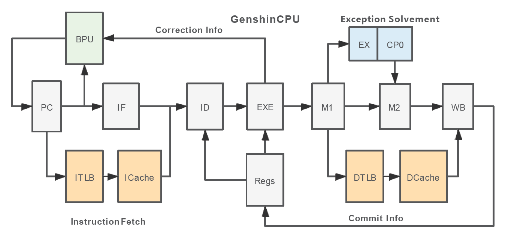
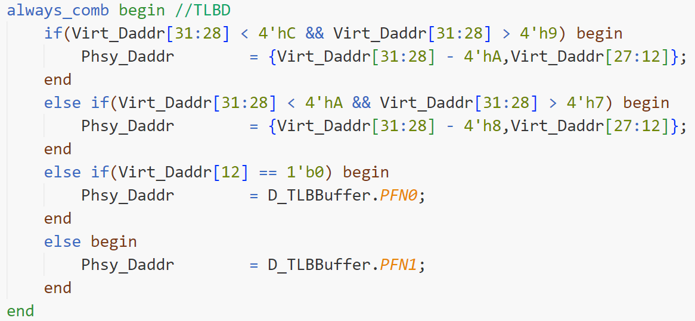
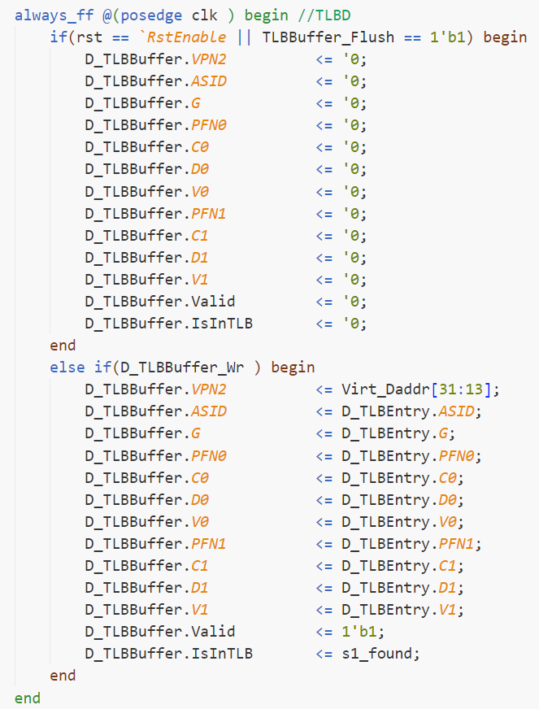
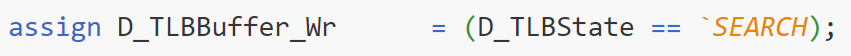

一、MEM1 DTLB

- 主要考察DTLB的输出。

1、Phsy_Daddr

```
    由于要Phsy_Daddr用于DCache访问，同时DCache也在MEM1级中，故物理地址是当拍立即得到的。（见上面的图片）。
    这里，D_TLBBuffer是核心，其保证在有虚地址的时候，能够立即返回正确的物理地址的PFN域。
```


2、D_TLBBuffer


```
    Buffer本质上是flip-flop。Buffer中存储一个TLB的项,还有一些其他的信号，如Valid,IsInTLB等等。其实更关键的是几个控制信号。
    TLBBuffer_Flush的定义见下，当读写TLB,或者写CP0的ENTRYHI的时候（这个啥意思?）TLBBuffer_Flush为1，也就是说这个时候TLBBuffer清空。
    当然最终送到DTLB的信号为TLBBuffer_Flush_Final,对TLBBuffer_Flush有微调。
    再看D_TLBBuffer_Wr信号。这个信号为1的时候,写TLBBuffer。D_TLBBuffer_Wr信号本身还依赖于一个二状态状态机。
    不要被状态机吓住了。DTLB模块仅仅是TLB模块的一项而已，说白了就是TLB中猜一项送给DTLB。如果正好碰对了，那甚至不需要看TLB。当然很有
可能碰不对，所以会阻塞一下流水线，去访问TLB，要是命中了就把DTLB更新一下。要是连TLB都没命中那就是事故了，要触发例外。状态机就是来解决这个问题的。
    状态机的状态(可以看Nextstate)取决于另一个信号:D_TLBBufferHit的值。这个值是个组合逻辑。时序分析如下:
    (i)第一个时钟周期:如果访问地址确实是落在mapped段，且未命中，这个时候nextstate由Idle->Search,同时立即发出阻塞信号，确保这条指令不会流走。
    (ii)第二个时钟周期:state由Idle->Search,同时D_TLBBuffer_Wr变成1。
    (iii)第三个时钟周期:把新的DTLB_Entry写入DTLB_Buffer,完成更新（不管有没有命中TLB）。后面利用DTLB_Buffer中的IsInTLB项来分析是否触发
TLB缺失例外。注意，新的DTLB_Entry一直由最新的D_VPN2(虚地址)获取，组合逻辑。如果把当前指令卡在MEM1级，自然就不会有变化。
```



3、其余output信号

- 相对都次要一点。
```
    D_IsCached：指示是否使用Cache
    D_IsTLBBufferValid:当DTLB未命中，或者命中DTLB但报出例外的时候，该值赋0.此时是肯定不能向DCache发送valid请求信号的。
    D_IsTLBStall:流水线阻塞信号
    MEM_TLBExceptType:TLB例外类型
    D_VPN2:VPN2位
```

- TOP_MEM里面最重要的就是DTLB和DCache,DCache部分和时序关系相对较小，暂且不讨论。倒是里面有几个refetch信号比较奇怪，似乎和TLB例外相关。
- ITLB的架构与DTLB几乎一模一样

二、PREIF Cache
1、硬件资源
```
    tag ram: 为了解决tag一直晚一拍到达，hit晚一拍得到的问题，引入xpm_memory_spram,设置其延时为0（注意参考学长代码Rams.sv）
    data ram: 同样也不再使用block ram，因其net delay较长;转而采用xpm_memory_sdpram,设置其延时为1（注意参考学长代码Rams.sv）;
    在ICache.sv中，读出的tag,rdata,送入的index,wdata均使用flip-flop。
```

2、Cache CPU的交互信号
```
    Cache控制流水级，只有一个signal:busy信号。这里我们不考虑uncache，所以busy = busy_cache。而busy_cache的生成逻辑如下图。
    不考虑Cache属性的话，也就是当req_buffer.valid = 1且pipe_cache_hit = 0时，busy信号为1。从时序分析的角度，req_buffer和
pipe_cache_hit是同步更新的。
    而CPU对Cache的信号就比较有趣。按照学长的架构，在Cache busy的时候依然可能向Cache发出请求，但是学长通过cpu_bus.stall控制req_buffer
以及pipe_wr的写使能，进而控制进入Cache的请求。我认为在我们的CPU中，应尽量在CPU空闲，且后面流水级无阻塞的情况下发请求，然后以请求信号
valid作为req_buffer的使能信号。
```


3、req_buffer及其时序
```
    对于所有送来的请求，我们都要用req_buffer锁住一拍，并用req_buffer的信息控制状态机。原因是为了缩短关键路径。在这种情况下，
我们再来分析一下CPU访问ICache的时序：
    假设ICache状态机处在LOOKUP状态，此时突然CPU发出一次请求，当拍可知道是否hit。那么如果是hit，状态机必然还是卡在LOOKUP阶段的。
    此时我们分析busy_cache的逻辑，发出的时刻必然busy_cache = 1'b0,而在下一拍,设若之后没有阻塞,req_buffer_en = 1'b1，那么
req_buffer.valid = 1'b1;又设若设若之后没有阻塞，pipe_cache_hit = 1'b1，这样busy_cache = 1'b0，逻辑自洽。
    如果当拍发现没有hit，且之后没有阻塞，那么可以想见,busy_cache在下一拍置为1，这样就阻塞了后序的ICache访问。
    
    然后分析MISS之后的情况。从MISS之后直至REFILLDONE（参考学长代码），req_buffer都是不会更新的。所以，访问硬件xpm_memory_spram的
index我们可以利用req_buffer锁住;hit信号需要用到发请求的tag和从硬件中读出的tag，那么发请求的tag在此期间也可以锁住。这样，直至
AXI重新装填完成硬件之前，req_buffer一直是同一个请求，装填完后当拍就是hit了。设计确实很精妙。
    注意，tag ram的读使能一直为1'b1，写使能为tagv_we,在state==REFILL的时候置为1;data ram的写使能同样在state==REFILL的时候置为1；
data ram读使能有待商榷，感觉一直为1'b1可以考虑。
```

2022.7.14
今晚读2019国科大报告，感觉Cache部分可优化极多，本人实在不称职，连FIFO都没有搞定。
可以考虑的几个优化方向，除了FIFO之外，还有:
Cache路数变化
加入Accelerator，消除单独sw miss带来的流水线阻塞
加入Victim buffer,处理被置换出的Cache line
考虑ICache预取

2022.7.16
Victim Cache思考:
```
    1、Victim DCache目前放在DCache部分，ICache先不处理。Victim Cache准备存放八组Cache line以及八组tag+index+v
    2、硬件方面: Cache line依然使用simple_port_ram处理,而tag+index+v(29 bit)依然使用tag ram,一拍读出。
    3、如何写Victim Cache:目前是有两种情况:
    第一种,Cache Miss且valid bit都为1,Victim Cache的index与req不相同(自然也不会命中)，则从AXI取回Cache line后,不再写入
Cache，而是写入Victim Cache。Victim Cache可以当成一循环链表来写,写入的位置可以用一个ptr来表征。
    第二种,Cache Miss但Victim Cache hit。(Cache和Victim Cache我们设计为互斥的,不可能同时命中)此时需要Cache与Victim Cache
交换Cache line,Cache需要交换的line由plru决定。同时肯定也要把tag+index+v交换一下。
    4、时序方面:第一拍发请求,当拍得到cache_hit和victim_hit;第二排数据进入reqbuffer,同时delayed_cache_hit和delayed_victim_hit
也能获得。如果是delayed_cache_hit=0且delayed_victim_hit=1,那么需要多阻塞一拍流水,下一拍把Cache line和tag line交换一下,这样
就与纯粹的二路Cache无异。如果delayed_cache_hit=0且delayed_victim_hit=0,则分情况讨论：
    (i) delayed_cache_hit=0,但tag ram中valid bit不全为1。这个时候从AXI取回Cache line,直接送Cache,Victim Cache写使能为0.
    (ii) delayed_cache_hit=0,且tag ram中valid bit全为1。此时需要再分两种情况:
        (a) Victim Cache中的所有index与req不符,或者valid bit为0。那么从AXI取回Cache line,直接送Victim Cache对应位置,Cache写使能为0.
        (b) Victim Cache中存在index于req相符,但是tag不符。那么从AXI取回Cache line,直接送Cache,Victim Cache写使能为0.
```


